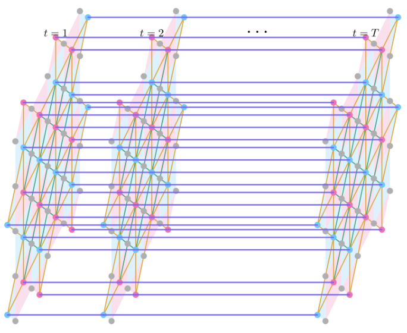

# Decoding the Surface Code with a Spatio-Temporal Transformer

This repository contains the code for the paper:

> **Decoding the surface code with a spatio-temporal transformer**
> Robert Joo, EPJ Quantum Technology (2026)
> [DOI: 10.1140/epjqt/s40507-026-00492-0](https://doi.org/10.1140/epjqt/s40507-026-00492-0)

We introduce a spatio-temporal transformer with graph Laplacian positional encodings and factorized spatial/temporal attention for decoding the surface code. The model matches or exceeds PyMatching on small-distance codes and generalizes across multiple noise models.

## Model Architecture

The decoder operates on a **spatio-temporal graph** over measurement rounds: intra-round edges encode the surface-code lattice at each time step; selected nodes are linked **across rounds** so the network can use temporal structure. Grey nodes are round-local; pink and blue nodes participate in cross-time connections (see paper for the full construction).

<p align="center">
  
</p>

The main model (`SpatioTemporalLocalTransformer`) uses:

- **Supra-Laplacian positional encodings** derived from the surface code's spatio-temporal graph
- **Factorized attention**: alternating spatial and temporal attention within each layer
- **Spatial radius mask** (radius=4): restricts spatial attention to local neighborhoods
- **Temporal sliding window** (size=3): restricts temporal attention to nearby rounds

For more details, please look at the paper. 


## Citation

```bibtex
@article{joo2026decoding,
  title={Decoding the surface code with a spatio-temporal transformer},
  author={Joo, Robert},
  journal={EPJ Quantum Technology},
  year={2026},
  doi={10.1140/epjqt/s40507-026-00492-0}
}
```

## License

This work is licensed under [CC BY-NC-ND 4.0](http://creativecommons.org/licenses/by-nc-nd/4.0/).
